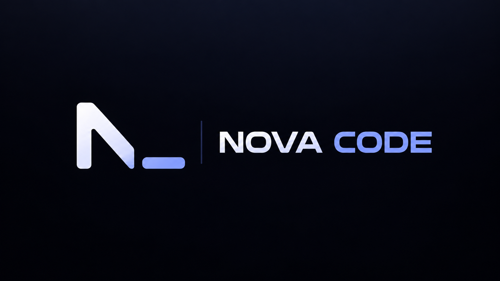

  
  
    
  
  
  
  
  

 

Welcome to the official GitHub organization for **Nova Code**. We are hyper-focused on one singular mission: **building the most powerful, autonomous Agentic AI CLI in the world.**

Nova Code is designed to live directly in your terminal. It doesn't just generate code for you to copy and paste—it physically explores your workspace, reads your files, executes bash commands, and writes code in a continuous, autonomous loop.

## 🌌 The CLI Ecosystem

To build a world-class CLI, we decoupled our architecture into 7 strictly typed, single-responsibility packages. Everything feeds into the main executable:

| Repository | Purpose |
|---|---|
| 👑 **[`novacode`](https://github.com/novacode-ai/novacode)** | The Master Workspace. Connects the entire CLI ecosystem via Git Submodules. |
| 💻 **[`cli`](https://github.com/novacode-ai/cli)** | The main executable REPL app that users install globally. |
| 🧠 **[`engine`](https://github.com/novacode-ai/engine)** | The AI brain. Houses the Agentic Loop and dynamic Markdown Skill Manager. |
| 🎨 **[`ui`](https://github.com/novacode-ai/ui)** | The beautifully responsive terminal interface and live CLI spinners. |
| 🛠️ **[`tools`](https://github.com/novacode-ai/tools)** | The core system abilities (bash, fs) and Model Context Protocol (MCP) Manager. |
| 🔌 **[`providers`](https://github.com/novacode-ai/providers)** | The dynamic model router connecting the CLI to OpenAI, Anthropic, and local Ollama. |
| ⚙️ **[`config`](https://github.com/novacode-ai/config)** | Secure user settings and workspace configuration management. |
| 🧩 **[`types`](https://github.com/novacode-ai/types)** | Shared TypeScript interfaces ensuring strict type-safety across the CLI monorepo. |

## 🚀 CLI Capabilities

1. **True Autonomy:** The CLI physically executes bash commands, spins up background tasks, and edits files to solve complex bugs.
2. **Local AI First:** We deeply support 100% offline development using **Ollama**. No API keys, no internet required.
3. **Model Context Protocol (MCP):** Connect standard MCP servers (Postgres, GitHub, FileSystems) to dynamically expand the CLI's toolset.
4. **Dynamic Skills:** Drop a `.md` file in your workspace, and the CLI instantly learns your team's unique testing, linting, and coding standards.

 

  <i>Redefining the command line experience.</i>

